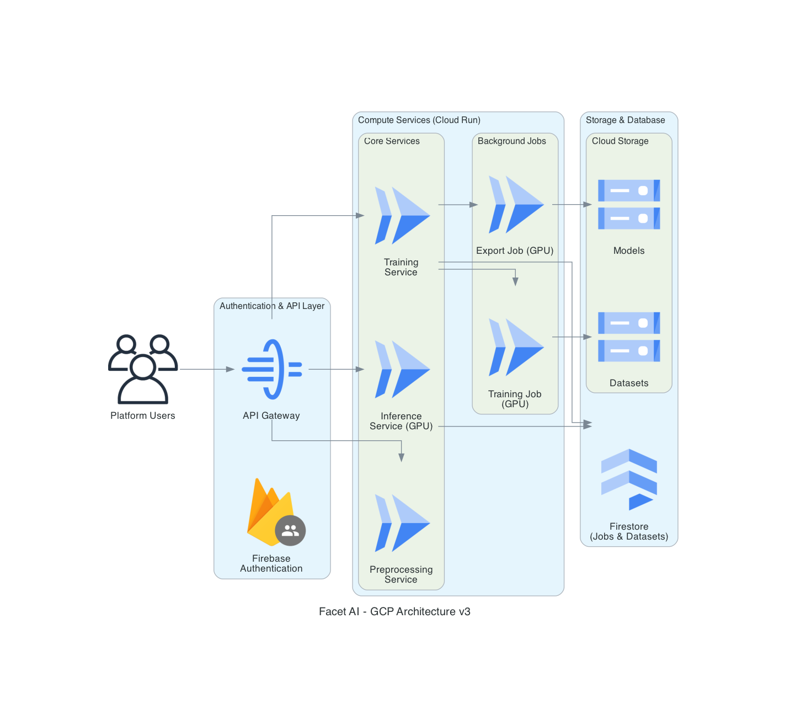

# Facet AI, LLM fine-tuning for everyone

Developed by two Google Summer of Code students at DeepMind, Facet AI is a no-code web platform to manage the fine-tuning workflows of DeepMind's Gemma 3 family of multimodal models. Handling everything from dataset preprocessing to model export, **Facet AI lets you focus on what matters for your use case, not writing boilerplate code and scrolling through pages of documentations and cookbook.**

We cannot wait to see what you bring to the **Gemmaverse** with Facet AI!

## Background

Cookbooks and Colab notebooks are amazing, except that they don't scale when you have multiple datasets, models, and experiments to track. Facet AI not only provides an open-sourced backend to streamline and centralize all your fine-tuning needs, but also makes it easy for non-technical users to leverage the power of cutting-edge post-training techniques and Google Cloud without writing a single line of code.

Watch our demo video!! 👇👇

## Features

| Category      | Feature             | Description                                                              | Supported Formats/Methods                                                        |
| ------------- | ------------------- | ------------------------------------------------------------------------ | -------------------------------------------------------------------------------- |
| **Dataset**   | Preprocessing       | Process vision and text data from custom uploads and Hugging Face        | Custom files, Hugging Face datasets                                              |
|               | Augmentation        | Enhance datasets using NLP techniques and LLM-based synthetic generation | Transformers, Gemini, NLTK generation                                            |
| **Training**  | Multiple Frameworks | Fine-tune using industry-standard frameworks                             | Hugging Face Transformers, Unsloth                                               |
|               | Training Methods    | Support for various post-training techniques                             | SFT (domain adaptation), DPO/ORPO (preference alignment), GRPO (reasoning tasks) |
|               | Optimized Training  | Flexible training approaches with quantization support                   | PEFT (LoRA, QLoRA), Full tuning, 4-bit/8-bit quantization                        |
|               | Multimodal Support  | Fine-tune both text and vision models                                    | Text and multimodal datasets                                                     |
| **Utilities** | Model Export        | Export trained models to multiple deployment formats                     | Adapters, merged, quantized, GGUF, Hub or GCS                                    |
|               | Training Monitoring | Comprehensive logging and monitoring to track your train jobs            | Weights & Biases, `trackio` (coming soon)                                        |
|               | Model Evaluation    | Task and metric evaluation, batch inference testing                      | Benchmarks, custom dataset, "vibe check", model comparison                       |
|               | Model Deployment    | One-click deployment of trained models to GCP for inference              | Cloud Run                                                                        |

### Coming Soon

- More data augmentation for vision and text datasets
- Audio modality support for Gemma 3n
- Full feature plan is tracked in [Project Roadmap](https://github.com/gemma-facet/cloud-services/issues/52)

## Usage

1. Use it for free on our website platform: [https://gemma-facet.vercel.app/](https://gemma-facet.vercel.app/)

2. Deploy the project to your own google cloud project with our Terraform and Cloud Build scripts, see `infrastructure/README.md` for details.

3. Use this as a reference to build your own fine-tuning service since we're fully open source!

## Architecture

## Documentation

- User docs are live on [here](https://facetai.mintlify.app)
- Developer docs are work in progress, use `README.md` in each directory for now
- API reference is auto generated by FastAPI and available together with user docs.
