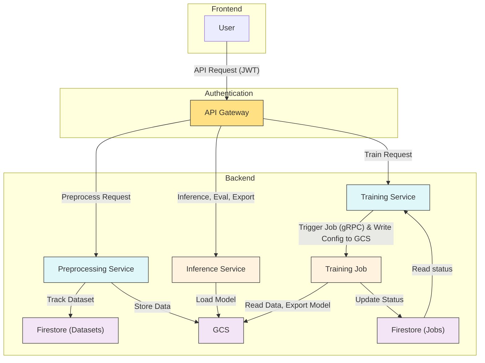

# Facet, a no-code fine-tuning PaaS for Gemma

Looking for a way to fine-tune small / vision language models without diving into complex code? Our no-code web platform simplifies the process of adapting LLM for task and domain specific use cases, allowing you to manage and run fine-tuning jobs effortlessly on Google Cloud Platform (GCP). From dataset preprocessing to model export, everything is customizable to your use case while being intuitive to use.

This is brought to you by Jet Chiang (@supreme-gg-gg) & Adarsh Dubey (@inclinedadarsh) as part of Google Summer of Code 2025 @ Google DeepMind.

## GSoC Midterm Demo

> A new demo is coming soon with more features as well as a beta release!

## Features

- Data preprocessing (for vision and text) from custom uploaded and huggingface datasets
- Data augmentation using NLP techniques and synthetic generation using LLM
- Fine-tuning using both Huggingface or Unsloth frameworks on text and multimodal datasets
- Fine-tuning with SFT for domain adaptation, DPO for preference alignment, and GRPO for reasoning tasks
- Fine-tuning with PEFT (LoRA, QLoRA) and full tuning, with quantization support (4-bit, 8-bit)
- Export to multiple formats (supports transformeres, vLLM, Ollama, llama.cpp, etc) to GCS bucket or huggingface hub
- Convert between different model formats to suite your deployment needs
- Cloud logging integration with Weights & Biases or TensorBoard
- Task-specific evaluation suites and batch inference ("vibe check") of fine tuned models

### Coming Soon

- IaC and deployment scripts so you can run this on your own GCP project!
- More data augmentation for vision and text datasets
- Audio modality support for Gemma 3n
- Direct deployment on GCP of fine tuned model using Ollama or vLLM (one-click and ready for inference)

## Usage

1. Use it for free on our website platform once it's live (beta coming soon!)

2. Deploy the project to your own google cloud project!

   We hope to support more flexible deployment options in the future.

3. Use this as a reference to build your own fine-tuning service since we're fully open source!

## Architecture

## Developers Notes

- Read the `README.md` in each subdirectory for more details.
- Deployment current uses `cloudbuild.yaml`, make sure you set the correct project ID with `gcloud config set project <project-id>`
- Unless you have a CUDA GPU don't try to install all packages for certain services, it will fail locally (especially on Mac), use Colab for experiments instead
